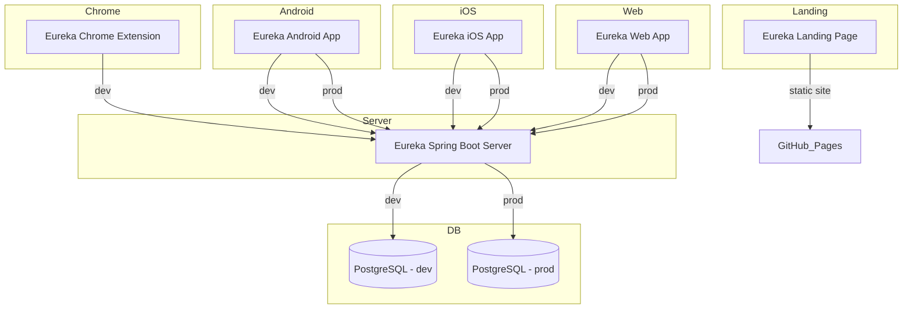

# 프로젝트 구조도

```mermaid
graph TD

subgraph Android
    A1[Eureka Android App]
end

subgraph iOS
    A2[Eureka iOS App]
end

subgraph Chrome
    A3[Eureka Chrome Extension]
end

subgraph Web
    A4[Eureka Web App]
end

subgraph Landing
    A5[Eureka Landing Page]
end

subgraph Server
    B1[Eureka Spring Boot Server]
end

subgraph DB
    C1[(PostgreSQL - dev)]
    C2[(PostgreSQL - prod)]
end

%% Connections
A1 -->|dev| B1
A2 -->|dev| B1
A3 -->|dev| B1
A4 -->|dev| B1

B1 -->|dev| C1
B1 -->|prod| C2

%% Prod path example
A1 -->|prod| B1
A2 -->|prod| B1
A4 -->|prod| B1

%% Landing page is static
A5 -->|static site| GitHub_Pages
```
