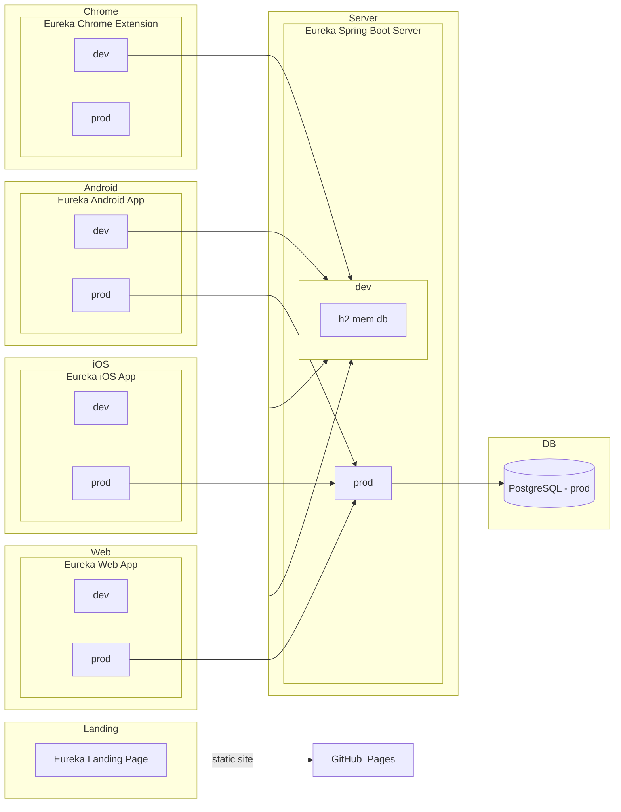

# 프로젝트 구조도

```mermaid
graph LR

subgraph Android
    subgraph A1["Eureka Android App"]
        A1_1[dev]
        A1_2[prod]
    end
end

subgraph iOS
    subgraph A2[Eureka iOS App]
        A2_1[dev]
        A2_2[prod]
    end
end

subgraph Chrome
    subgraph A3[Eureka Chrome Extension]
        A3_1[dev]
        A3_2[prod]
    end
end

subgraph Web
    subgraph A4[Eureka Web App]
        A4_1[dev]
        A4_2[prod]
    end
end

subgraph Landing
    A5[Eureka Landing Page]
end

subgraph Server
    subgraph B1[Eureka Spring Boot Server]
        subgraph B1_1[dev]
            B1_1_1[h2 mem db]
        end
        B1_2[prod]
    end
end

subgraph DB
    C1[(PostgreSQL - prod)]
end

%% Connections
A1_1 --> B1_1
A2_1 --> B1_1
A3_1 --> B1_1
A4_1 --> B1_1

B1_2 --> C1

%% Prod path example
A1_2 --> B1_2
A2_2 --> B1_2
A4_2 --> B1_2

%% Landing page is static
A5 -->|static site| GitHub_Pages
```
